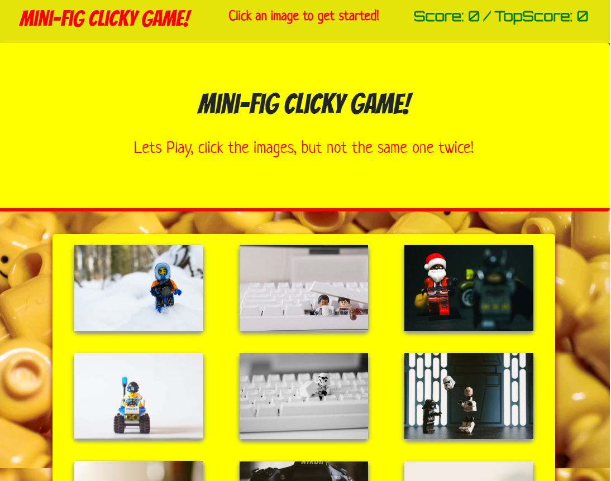

# Clicky-Game

## Link to Live pages

https://bauter.github.io/Clicky-Game/

## What this apps about?

Mini-fig Clicky-Game, the purpose of this project was to create a simple react game. The objective is to click an image of a mini-fig to score points. On each click, the images will shuffle around. If the same image is clicked twice, the game is over.

;